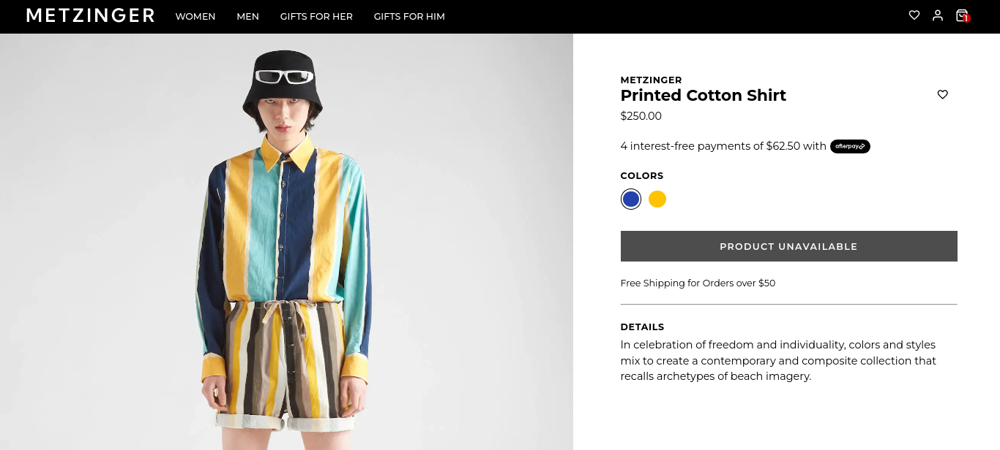
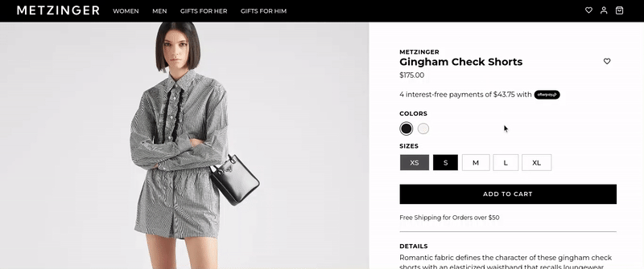

<div id="top" />


<h2 align="center"><a href="https://metzinger.onrender.com/">Click for Live Demo</a></h2>

**Metzinger** is a React web application that uses Redux Toolkit and PostgreSQL to emulate an e-commerce experience. It includes a fully functional cart from adding items to receiving order information, products filtered by category, a wishlist.

### Table of Contents

- [About the Project](#about)
  - [Technologies](#technologies)
  - [Features](#features)
  - [Goals](#goals)
- [Screenshots](#screenshots)
- [Getting Started](#getting_started)
  - [Prerequisites](#prerequisites)
  - [Installation](#installation)
- [Contributing](#contributing)
- [License](#license)

<p align="right">(<a href="#top">back to top</a>)</p>

## About the Project <a name="about"></a>

### Technologies <a name="technologies"></a>

[![React][react.js]][react-url] 
[![Redux Toolkit][redux-toolkit]][redux-url] 
[![Styled Components][styled-components]][styled-components-url] 
[![PostgreSQL][postgresql]][postgresql-url]

### Features <a name="features"></a>

- Look through multiple categories of items
- Full authentication process with JWT and Postgres
- Add and remove items from a wishist
- Interact with a shopping cart with CRUD functionality.

### Goals <a name="goals"></a>

- Become more familiar with Styled Components and relational databases with PostgreSQL
- Emulate a basic e-commerce pattern from adding items to cart to receiving order details

<p align="right">(<a href="#top">back to top</a>)</p>

## Screenshots <a name="screenshots"></a>





<p align="right">(<a href="#top">back to top</a>)</p>

## Getting Started <a name="getting_started"></a>

### Prerequisites <a name="prerequisites"></a>

Create an .env.local file in the client folder, and enter fields as such:

```
REACT_APP_IMAGE_HOST_URL = [your image host url here]
REACT_APP_BASE_URL = [base url of your react app]
```

Then, create an .env.local file in the server folder, and input your API key as such:

```
PORT = [your port]

USER_NAME = [your postgres username]
PASSWORD = [your postgres password]
HOST = '[name of the host, in my case 'localhost']
DATABASE = [name of the dataabase]
DB_PORT = [port of the database]

JWT_SECRET = [a custom jwt secret for web token authentication purposes]
```

### Installation <a name="installation"></a>

Clone the repo and install through your method of choice.

```
$ git clone https://github.com/justinpv98/metzinger-ecommerce.git
$ cd metzinger-ecommerce
$ npm install
```

Run a development server.

```
$ cd client
$ npm start

$ cd ../server
$ npm start
```

<p align="right">(<a href="#top">back to top</a>)</p>

## Contributing <a name="contributing"></a>

Contributions, issues and feature requests are welcome.
<p align="right">(<a href="#top">back to top</a>)</p>

## License <a name="license"></a>

Distributed under the MIT License. See `LICENSE` for more information.

<p align="right">(<a href="#top">back to top</a>)</p>

<!-- LINKS -->


[react.js]: https://img.shields.io/badge/react-20232A?style=for-the-badge&logo=react&logoColor=61DAFB
[react-url]: https://reactjs.org/
[redux-toolkit]: https://img.shields.io/badge/redux_toolkit-764ABC?style=for-the-badge&logo=redux&logoColor=white
[redux-url]: https://redux.js.org/
[styled-components]: https://img.shields.io/badge/styled_components-DB7093?style=for-the-badge&logo=styledcomponents&logoColor=white
[styled-components-url]: https://styled-components.com/
[postgresql]: https://img.shields.io/badge/postgresql-4169E1?style=for-the-badge&logo=postgresql&logoColor=white
[postgresql-url]: https://www.postgresql.org/
